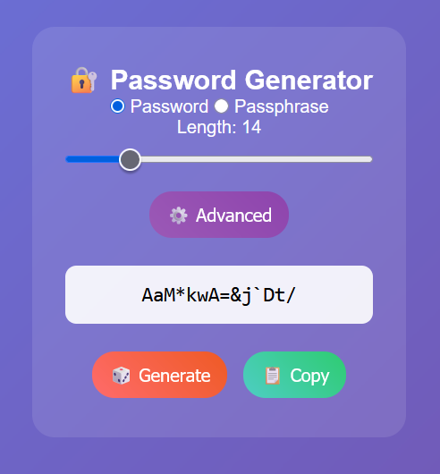
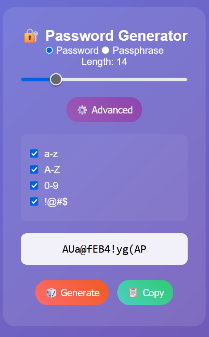
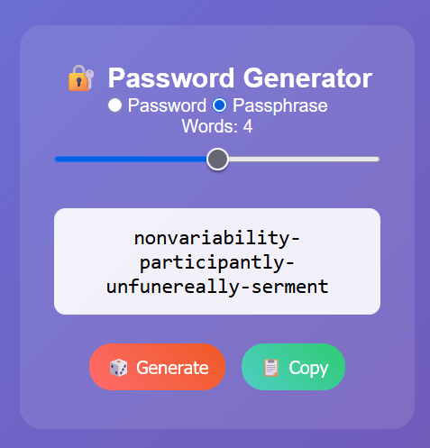

<div align="center">

# 🔐 Password Generator

*Strong • Random • Secure*

[](https://kritarth.byethost14.com/password_generator/)
[]()
[]()
[]()

**Create unbreakable passwords in seconds**

[🔐 Password Manager](https://kritarth.byethost14.com/password_manager/login.php) • [🚀 Try Generator](https://kritarth.byethost14.com/password_generator/) • [📖 How to Use](#how-to-use)

</div>

---

## ✨ What It Does

Make strong passwords that hackers can't guess. Works in your browser.

## 🎯 Features

### 🔢 **Password Mode**
- Length: 8-40 characters
- Random letters, numbers, symbols
- Copy with one click

### 📝 **Passphrase Mode**
- Length: 2-6 words
- Easy to remember
- Great for master passwords

### ⚙️ **Character Options**
- **a-z** → lowercase letters
- **A-Z** → UPPERCASE letters  
- **0-9** → numbers
- **!@#$** → special symbols

## 🚀 How to Use

1. Pick **Password** or **Passphrase**
2. Choose how long
3. Select character types
4. Click **Generate**
5. Click **Copy** to use it

## 💡 Why Strong Passwords?

**Weak**: `password123` ❌  
**Strong**: `K9#mL2$pX7@nV4` ✅

Strong passwords keep hackers out of your accounts.

## ⚙️ Simple Settings

| Setting | What It Adds |
|---------|-------------|
| a-z | Small letters (abc) |
| A-Z | Big letters (ABC) |
| 0-9 | Numbers (123) |
| !@#$ | Symbols (!@#) |

## 🔒 Quick Tips

- **Longer = Stronger** (use 12+ characters)
- **Mix Everything** (letters + numbers + symbols)
- **Different for Each Site** (don't reuse passwords)
- **Store Safely** with [Password Manager](https://kritarth.byethost14.com/password_manager/login.php)

## 📱 Works Everywhere

- ✅ Any computer
- ✅ Any phone
- ✅ Any browser
- ✅ Works offline

## 🛠️ Built With

- PHP + HTML - The structure
- CSS - The look
- JavaScript - The password making

## 🎨 Simple Interface

```
Password Generator
┌─────────────────────┐
│ Type: Password ▼    │
│ Length: ━━●━━━━━━━  │
│ ☑ a-z ☑ A-Z ☑ 0-9  │
│ ☑ Symbols           │
│ K9#mL2$pX7@nV4      │
│ [Generate] [Copy]   │
└─────────────────────┘
```

## 📸 Screenshots

|  |  |  |
|:--:|:--:|:--:|
| Password Generator | Advanced Options | Passphrase Password |

## 🔗 Works Great With

[🔐 Password Manager](https://kritarth.byethost14.com/password_manager/login.php) - Save your new passwords safely


## 📖 Documentation
For full project details, setup instructions, and feature overview, check out the:

👉 []([https://sleepy-lyric-28b.notion.site/Password-Manager-24d059d9?pvs=73](https://sleepy-lyric-28b.notion.site/Password-Generator-24d05f803ca580e9b13cfbfadef39feb?pvs=73))


## ⚡ Two Modes

**Password Mode:**
- 8-40 characters
- Random mix
- Hard to crack

**Passphrase Mode:**
- 2-6 words
- Easy to remember
- Still very secure

## 📜 License

MIT License - Use freely, modify, share. See [LICENSE](LICENSE) file.

---

<div align="center">

**Make strong passwords in seconds! 🛡️**

*Your security starts with a strong password*

</div>
